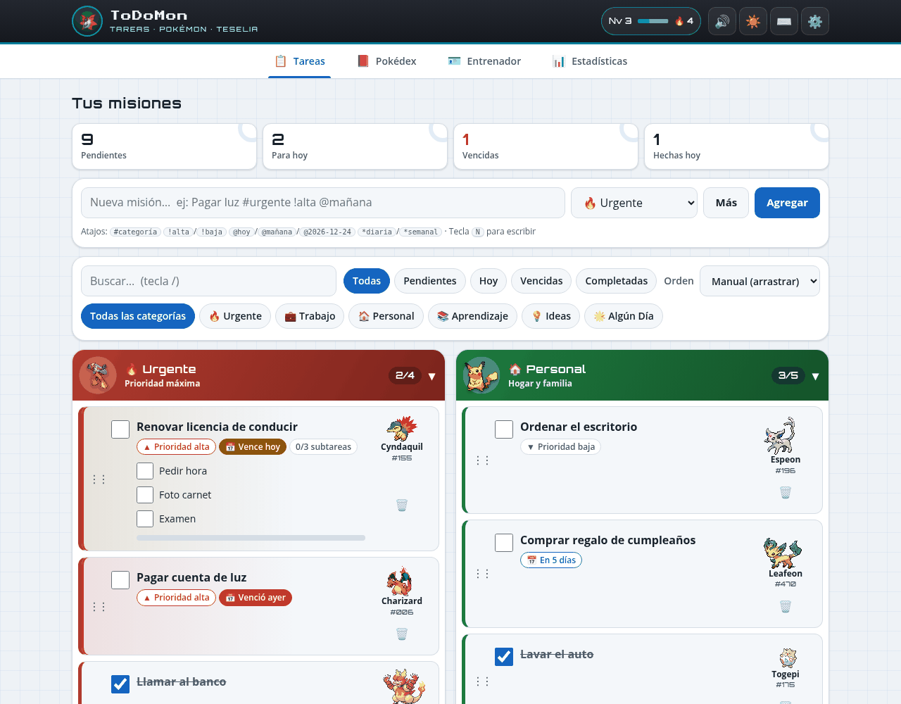
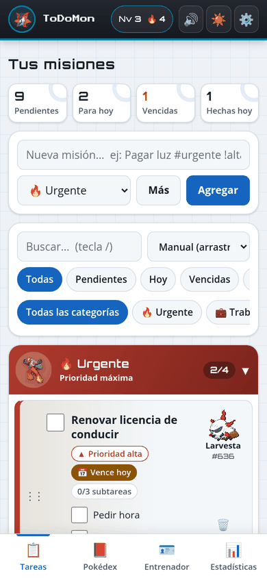

# 🎮 ToDoMon

> **Para los amantes de Pokémon, ¡una Poke ToDo list!**



Una aplicación de tareas gamificada donde tus pendientes cobran vida. Cada tarea es un Pokémon que evoluciona a medida que avanzas, transformando tu productividad en una aventura clásica de Pokémon.

> [!NOTE]
> **Estado actual (v6.0)**: interfaz nueva inspirada en el C-Gear de Teselia, con fechas límite, prioridades, búsqueda y filtros, tareas recurrentes, deshacer, tarjeta de entrenador con medallas, estadísticas y modo instalable (PWA). Los datos de v5.2 y v5.3 se migran solos, con copia de seguridad. Ver [Novedades v6.0](#-novedades-v60).


[](LICENSE)

---

## ⚡ Características principales

Esta no es una lista de tareas ordinaria. Aquí, completas misiones para **construir tu equipo Pokémon**:

-   **Tareas que evolucionan**:
    -   Cada tarea es un Pokémon de su categoría. Al completar el 50% de las subtareas evoluciona, y al 100% llega a su etapa final y queda registrado en tu Pokédex.
    -   1 de cada 16 completadas resulta **variocolor** ✨ (+25 XP). Las Ideas también pueden nacer variocolor.
    -   Las tareas de **Algún Día** son objetos de aventura (Poké Balls y piedras evolutivas).

-   **Productividad de verdad**:
    -   **Agregado rápido** con atajos: `Pagar luz #urgente !alta @mañana *semanal`.
    -   **Fechas límite** con resaltado de "vence hoy" y "vencida".
    -   **Prioridades** (alta, media, baja) que suman o restan XP.
    -   **Recurrentes** diarias y semanales: al completarlas aparece la siguiente.
    -   **Búsqueda**, filtros por estado y categoría, y orden manual (arrastrar o flechas), por fecha o por prioridad.
    -   **Deshacer** la última eliminación (Ctrl+Z o el botón del aviso).
    -   **Atajos de teclado**: `N` nueva tarea, `/` buscar, `1`–`4` cambiar de vista, `?` ayuda.

-   **Entrenador, Pokédex y estadísticas**:
    -   Nivel y experiencia (50 XP por tarea, 10 por subtarea, +20 si es prioridad alta), racha de días y 8 medallas de Teselia por hitos.
    -   Tarjeta de entrenador con nombre, ID y compañero elegido.
    -   Pokédex de las generaciones 1 a 5 (649 Pokémon) con porcentaje por región y filtros.
    -   Estadísticas por semana y por categoría.

-   **Hábitat**:
    -   Los Pokémon de tus tareas pasean por la pradera del pie de página; al hacer clic se abre la tarea.
    -   Ciclo día/noche según el tema. De noche, cielo estrellado.

-   **Instalable y sin conexión**:
    -   PWA: se puede instalar desde el navegador (botón "Instalar app" en Ajustes cuando el navegador lo permite).
    -   Funciona sin conexión: la app y los sprites ya vistos cargan desde el service worker.
    -   Exportar e importar un respaldo JSON (antes de importar se guarda una copia).
    -   Sonidos (gritos de Pokémon) con interruptor, y avisos opcionales de tareas de hoy o vencidas mientras la app está abierta.

-   **Categorías**:
    -   🔥 **Urgente**: Pokémon de Fuego para máxima prioridad.
    -   💼 **Trabajo**: cadenas evolutivas completas.
    -   🏠 **Personal**: Pokémon amigables.
    -   📚 **Aprendizaje**: tipo Psíquico.
    -   💡 **Ideas**: legendarios y creativos (con probabilidad variocolor).
    -   🌟 **Algún Día**: objetos de aventura.



## 🚀 Cómo empezar

No necesitas instalar nada: es HTML, CSS y JavaScript puros, sin compilación.

1.  **Clona el repositorio:**
    ```bash
    git clone https://github.com/nashishoo/Poke-ToDo-List-5gen.git
    cd Poke-ToDo-List-5gen
    ```

2.  **Juega:**
    -   Abre `index.html` directamente en tu navegador (funciona como archivo local).
    -   Para los gritos de los Pokémon, la instalación como app y el modo sin conexión, sírvela por HTTP:
        ```bash
        python -m http.server 8000
        # o
        npx serve .
        ```

También puedes usarla directamente en GitHub Pages: **https://nashishoo.github.io/Poke-ToDo-List-5gen/**

## 🆕 Novedades v6.0

-   **Interfaz nueva** estilo C-Gear (Teselia), con tema claro, oscuro y automático, navegación por pestañas y barra inferior en el móvil.
-   **Fechas, prioridades, recurrencias, búsqueda, filtros y reordenamiento** por arrastre o teclado.
-   **Deshacer eliminaciones**, agregado rápido con sintaxis de atajos y atajos de teclado.
-   **Tarjeta de entrenador** con nivel, XP, racha y estuche de 8 medallas.
-   **Pokédex** con porcentaje total y por región, y **estadísticas** semanales y por categoría.
-   **PWA**: manifest, iconos y service worker para instalarla y usarla sin conexión.
-   **Respaldo JSON** de exportación e importación.
-   **Migración segura desde v5.2 y v5.3**: se conserva todo (las categorías antiguas o desconocidas pasan a una categoría actual en vez de borrarse), se mantiene el nivel y se guarda una copia completa de los datos anteriores en `todomon_backup_v5`. Las claves originales de v5 no se borran.
-   Se mantiene todo lo corregido en v5.3: cadenas evolutivas verificadas, estado de las tareas al desmarcar, nombres actualizados al evolucionar y sprites animados nítidos.

## 🛠️ Stack tecnológico

Construido con estándares web puros, sin compilación:

-   **HTML5, CSS3 y JavaScript** clásico (sin módulos ni frameworks), dividido en `js/data.js`, `js/store.js`, `js/sprites.js`, `js/habitat.js` y `js/app.js`.
-   **PokeAPI**: sprites animados de Pokémon Negro/Blanco, nombres en español, medallas y gritos.
-   **localStorage**: tareas, progreso, Pokédex y ajustes se guardan en el navegador (clave `todomon_v6`).
-   **Service worker** (`sw.js`) para el modo sin conexión.

## 📄 Licencia

Código bajo licencia [MIT](LICENSE). Pokémon es marca de Nintendo, Creatures Inc. y GAME FREAK inc.; los recursos gráficos y de audio se cargan desde PokeAPI y no forman parte del repositorio.

## 🤝 Contribuir

¿Tienes ideas para una nueva generación? ¡Los Pull Requests son bienvenidos!

1.  Haz un Fork del proyecto.
2.  Crea tu rama de características (`git checkout -b feature/AmazingFeature`).
3.  Commit a tus cambios (`git commit -m 'Add some AmazingFeature'`).
4.  Push a la rama (`git push origin feature/AmazingFeature`).
5.  Abre un Pull Request.

---

<div align="center">


### Dolan
[](https://github.com/nashishoo)

</div>
